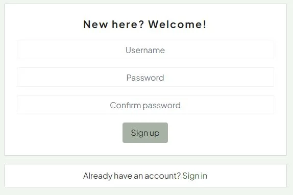

# GreenThumb  - Frontend

 - use an image from AmIResponsive that shows the site on multiple devices

## Introduction

This is the frontend of the project GreenThumb Hub. You can find the backend repository [here](https://github.com/FridaWikell/greenthumb-backend).

The project is about creating a social media, a hub, for all gardeners. The purpose is to show other green fingered fellows how your garden is progressing, to ask for advice and questions or just have a fun time and find new friends with the same hobby as yourself.

## Table of Contents

## User Experience

### User Goals

The user goal is to be able to share the interest and hobby with other green fingered people. They should be able to communicate and learn from each others knowledge.

### Site Owner Goals

The site owner goal is to provide a place where the green fingers can grow and crack in bloom.

### User Stories

A total of four epics and nine user stories were created. Two of the user stories were classified as "won't have" and haven't been fulfilled or worked at in this iteration. To view all epics and user stories for the frontend are collected at a project board [here](https://github.com/users/FridaWikell/projects/8).

All user stories are labeled with must have, should have, could have or won't have, depending on prioritization according to MoSCoW prioritization. Each of all user stories are also labeled with a point. The point is an estimate in how long time it will take to finish the acceptance criterias in the user story. All acceptance criterias are presented in each user story at the project board.

| Class | Points | Percentage of total points |
| -------- | ----- | ------------------------ |
| Must have | 8 p | 17 % |
| Should have | 4 p | 8 % |
| Could have | 8 p | 17 % |
| Won't have | 28 p | 58 % |

#### [Epic - Content creation and interaction](https://github.com/FridaWikell/greenthumb-front/issues/1)

As a user, I would like to upload posts and interact with other users' content, so that I can share my gardening experiences and learn from the community.

**User Story - Upload posts**

As a user, I would like to upload posts and attach images, so that I can share my gardening experiences with the community.

Acceptance Criteria:

- Acceptance Criteria 1  
Given a user is logged in and navigates to the post creation page  
When they enter text and attach images  
Then the post is published to their profile and visible in their followers' feeds and main feed  
- Acceptance Criteria 2  
Given a user attempts to submit a post without filling out all required fields  
When they press the submit button  
Then they are notified which required fields need to be filled out before the post can be published  

**User Story - Edit and delete posts**

As a user, I would like to edit and delete my own posts, so that I can manage my shared content.

Acceptance Criteria:

- Acceptance Criteria 1  
Given a user is viewing a post they have created  
When they select the option to edit the post and submit the changes  
Then the post is updated with the new content  
- Acceptance Criteria 2  
Given a user is viewing a post they have created  
When they select the option to delete the post  
Then the post is removed from the platform and their profile  

**User Story - Comment on posts**

As a user, I would like to comment on posts, so that I can engage in discussions and share my thoughts or advice with the community.

Acceptance Criteria:

- Acceptance Criteria 1  
Given a user is logged in and viewing a post  
When they submit a comment on the post  
Then their comment is displayed under the post for others to see  
- Acceptance Criteria 2  
Given a user is not logged in  
When they attempt to submit a comment on a post  
Then their comment is not posted  

**User Story - Edit and delete comments**

As a user, I would like to edit and delete my comments on posts, so that I can correct mistakes or remove comments I no longer wish to share.

Acceptance Criteria:

- Acceptance Criteria 1  
Given a user is viewing their own comment on a post  
When they select the option to edit the comment and submit the changes  
Then the comment is updated with the new content  
- Acceptance Criteria 2  
Given a user is viewing their own comment on a post  
When they select the option to delete the comment  
Then the comment is removed from the post  
- Acceptance Criteria 3  
Given a user is viewing a comment on a post  
When they are not the author of the comment and attempt to edit or delete it  
Then the system denies the action  

#### [Epic - Community engagement](https://github.com/FridaWikell/greenthumb-front/issues/7)

**User Story - Ask questions**

As a user, I would like to ask questions with options for answers, so that I can get advice on specific gardening dilemmas.

Acceptance Criteria:

- Acceptance Criteria 1  
Given a user has a question about gardening  
When they post the question with predefined answer choices  
Then other users can vote on the options, providing the asker with community feedback  
- Acceptance Criteria 2  
Given a user has asked a question with options for answers  
When the user wants to see how other people have answered  
Then the results are displayed  
- Acceptance Criteria 3  
Given a user is not logged in  
When they attempt to create a question or vote on an existing question  
Then it is not registered  

#### [Epic - Content discovery](https://github.com/FridaWikell/greenthumb-front/issues/10)

**User Story - Search content**

As a user, I would like to search the platform, so that I can discover content that matches my gardening interests.

Acceptance Criteria:

- Acceptance Criteria 1  
Given a user is looking for specific gardening content  
When they use the search function with keywords  
Then they are presented with content relevant to their search criteria  
- Acceptance Criteria 2  
Given a user enters a search term that yields no results  
When they submit the search  
Then they are informed that no results were found and suggested to refine their search terms  

#### [Epic - Cross-device compatibility and accessibility](https://github.com/FridaWikell/greenthumb-front/issues/12)

As a site owner, I want the platform to be accessible and fully functional across all devices, so that users can seamlessly engage with the community, regardless of how they access the site.

**User Story - Ensuring responsive design for multiple devices**

As a site owner, I would like to ensure the platform is fully responsive and provides a seamless experience across all devices, so that users can engage with the community whether they are on a desktop, tablet, or smartphone.

Acceptance Criteria:

- Acceptance Criteria 1  
Given a user accesses the platform from a mobile device  
When they navigate through the site and interact with its features  
Then the layout, text, and interactive elements adjust to provide an optimal viewing and interaction experience on a smaller screen  
- Acceptance Criteria 2  
Given a user switches between devices to access the platform  
When they resume their activity on a different device  
Then they experience consistent functionality and aesthetics, ensuring engagement continuity regardless of the device used  

**User Story - Accessibility compliance**

As a site owner, I would like the platform to meet accessibility standards, so that users with disabilities can also seamlessly engage with the community.

Acceptance Criteria:

- Acceptance Criteria 1  
Given a user with visual impairments uses screen reading software to access the platform  
When they navigate through the site  
Then all content is accessible via the screen reader, with all images having alt text and all actionable items being screen-reader friendly  

## Design

### Color Scheme

The colors at the website are chosen to be earthy and calming. The main colors are green and brown to get the thoughts to plants and soil. All the colors are subtly faded, enhancing the calming impression. The first color which everything else is based at is the color of the navigation bar. It was chosen by deciding on a green color and then testing numerous colors selected from a color palette.

### Typography

The typography is selected to be easy to read but at the same time be playful. It was selected by scrolling through fonts at Google fonts after selecting to only show the "Sans Serif" fonts.

### Imagery

The images are all styled as cartoons and selected to give the website a unified feeling by maintaining consistency in style wherever users browse on the site. The number of images is kept low to ensure that users' published images really pop and draw the most attention.

### Wireframes

## Features

### Navigation bar

The navigation bar makes it easy for the user to navigate around at the website. Both the logo and the home icon brings the user back to the home page to view all posts. To have a home link in the logo makes it possible for the users using small devices (where only the logo and the menu icon is showing) easy navigate to the posts page (home page).

### Sign up page

The sign up page allows a new user to sign up to the page. The password needs to be entered twice to make sure the user doesn't enter a misspelled password. If the user already has a profile, they can use the link to the sign in page.

### Sign in page

The sign in page lets the user to sign in by entering their selected username and password and press Sign in. If the user hasn't signed up yet, it is a link which will take them there.

### Home page/Plant friends

**Search field**

The search field allows the user to filter the content they want to see. If they search for "tomato", only posts with the word "tomato" in it will show.

**Add post button**

The add post button directs the logged in user to create post page. If the user isn't logged in, it get redirected to the home page. 

### Post page

**Post**

The post present all the information the user has filled out when they created a post. It contains username, when they published the post, title of the post, content of the post, image (if they have uploaded any), which hardiness zone the post is from, like button, number of likes, comment button and number of comments.

**Like - not logged in**

The user has to be logged in to like a post. If they aren't logged in, a tooltip appear "Log in to like post".

**Like - logged in**

When the user is logged in and the user has liked a post, the like button become red and number of likes updates. This allows the user to like and unlike a post. Liked - the button is read, unliked - the button is white.

**Comment - not logged in**

If the user isn't logged in, they don't get an opportunity to write a comment.

**Comment - logged in**

If the user is logged in, they can write a comment. Next to the comment field the logged in users' profile image is to mark that they are writing as the logged in user.

**Dropdown menu - owner of the post**

If the user visit a post which they is the owner to, a more dropdown menu marked with three dots are visible. If they click at it, they get two selection. The first is to edit the post, if they press it they will be redirected to edit post page. The second is to delete the post, if they press it they will trigger a confirmation modal.

**Confirmation modal - delete post**

If the user presses delete, a confirmation modal is triggered. It gives the user a chance to change their mind if they really want to delete their post. It also gives the chance to save the user if they clicked at delete by mistake.

**Most followed profiles - not logged in**

The most followed profiles list the profiles with most followers. If the user isn't logged in, they only see the profile image and the username.

**Most followed profiles - logged in**

The most followed profiles list the profiles with most followers. If the user is logged in they see the profile image and the username. After that, they see a follow or unfollow button. Which of them they see depends on the logged in user follows the user in the list or not. If the user click at the button, it performs the action of the buton (follow/unfollow). If the logged in user is in the list, they don't see a button at all. 

### Edit post page

The fields in the edit post page are prepopulated with the information from the post who is edited. It allows the user to change the title, content, image and hardiness zone. If the user wants to delete their changes, the press Cancel and no changes are saved. When they are happy with their changes, they press Save.

### Questions page

**Add question button**

The add question button directs the logged in user to the add question page.

**Search question field**

The search field allows the user to filter the content they want to see. If they search for "green", only questions with the word "green" in it will show.

**Question - not the owner**

The question is presented in the title and the name of the user who asked the question and when they did it are below the title. The answers are listed below. The users can select the answer they think is the correct, and the press Submit. To give the user feedback when they vote has been submitted, a pop up modal is triggered. The user can see the results by pressing See results. They can see the results even though they haven't voted yet. This to make the community learn from each other without being required to do anything. If the voting user already has voted, a already voted pop up modal is triggered.

**Question - the owner**

If you are the owner to a question, you see everything as a user which isn't the owner but with one addition. The user who owns the question has the three dots dropdown menu as an addition to the right hand side.

**Question dropdown**

The dropdown is only visible for users who owns the question. It has one option, delete question. The user isn't able to edit the question since they aren't allowed to change the meaning of the question after people have voted. If you press the delete option, a confirm deletion modal is triggered.

**Confirm deletion modal**

The confirm deletion modal gives the user a chance to change their mind, if they want to keep the question. It also gives the user a chance to save themselfs if they pressed at delete by mistake. If they don't want to delete the question, they press Cancel. If they still want to delete the question, they press Confirm.

**Thank you for voting modal**

When the user has submitted a vote, a thank you for voting modal is trigged. It gives feedback to the user, letting them know everything has worked. The Close button allows the user go back to the website.

**Already voted modal**

If the user already has made one successful vote at one question and they try to vote again, a already voted modal is triggered. It tells the user they already has voted. The Close button closes the modal.

### Add question page

The add question page has fields for question and answers. The plus button increases number of answer fields by one. The minus button decreases number of answer fields by one. The Cancel button discard the question draft. The Submit button create the question and the users can now vote.

### Profile page

**Profile page - not the owner**

The profile page of a user who isn't the owner of the profile. It shows a Follow or Unfollow button (depending on the logged in user follow the profile or not). When you click the button it performs the action on the button (follow/unfollow). The title is the profile's username. To the left, the chosen profile image is shown. Number of published posts, followers and following are presented. 

**Profile page - is the owner**

The difference between the profile page for a user who is the owner of the profile or not, is the Follow/Unfollow button and three dots menu. When the user is the owner, the Follow/Unfollow button isn't visible. Instead, a three dots dropdown menu is visible.

**Edit profile dropdown**

If the logged in user is the owner of the profile, the three dots dropdown is visible. If the user presses it, it can choose from edit profile, change username or change password. This allows the user to enter more information about themself or correct information if they previously filled out wrong. To change the password is important to ensure the users security.

### Edit profile page

At the edit profile page the user can edit information about themselfs as real name and a small presentation about themself. The presentation is presented at the profile page. The user can also change the profile image. If the user already has filled out some information, it is prepopulating the fields. 

### Change username page

The current users' username are prepopulated when the user enters the edit username page. They can change the username to a name which isn't at use at the website.

### Change password page

The user can change their password by filling out their new password twice. This to ensure the user doesn't spell the new password wrong.

## Features to be Added

Several features can be added in the future. Some of them are listed below.

| Feature | Explanation and benefits |
| ---------- | ------------- |
| Sending private messages | If the users can send private messages to each other they can communicate and have deeper discussions about their plant interest. |
| Receive notifications | When a comment is posted at your post, a notification would appear. The notifications could also expand and cover if a user like your image, if a followed user publish a post or questions and so on. If the user receives notification can be a way to make the user more interest and more involved in the webpage and what's happening there. |
| Plant exchange page | If a user has a plant they don't want anymore, they can post it at a plant exchange page and other users can express interest at the plant. This can enhance the community feeling and at the same time avoid plants being thrown away when someone else can have use for them. |
| Sign in with social media and Google credentials | Instead of the user signing in with username and password, the user can select to sign in with their social media account or Google account. This makes it easier for the user to sign in since they don't need to remember another username and password. |

## Testing

### Validation of Code

#### HTML

Since the project was created with React and uses JSX, the HTML validation is included in the JavaScript validation.

#### CSS

The validation of all CSS files at [W3C CSS Validation Service](https://jigsaw.w3.org/css-validator/validator.html.en) resulted without any errors.

#### JavaScript

Validation of JavaScript was done with [ESLint](https://eslint.org/) in Gitpod. It resulted without any errors.

### Lighthouse
You can perform a test of your website for performance, accessibility, best practices and SEO through the google chrome lighthouse test - it is in your Dev tools. Bear in mind that your internet connection speed plays a part in the performance figures obtained. Where it scores low, it will give you suggestions on how to improve the site - read the suggestions and think about how to implement them - it could be a good idea.
Do this for both Desktop and Mobile.

### Wave Webaim - accessibility testing

All pages were tested at the [Wave Webaim](https://wave.webaim.org/) extension for Chrome. It resulted without any errors or contrast errors at all pages.

The result for the index page:

The rest of the Wave Webaim validation can be found in the doc folder.

- [404 page](doc/wave-404.webp)
- [Add post](doc/wave-add-post.webp)
- [Add question](doc/wave-add-question.webp)
- [Change username](doc/wave-change-username.webp)
- [Edit profile](doc/wave-edit-profile.webp)
- [Plant friends](doc/wave-plant-friends.webp)
- [Post page](doc/wave-post-page.webp)
- [Profile page](doc/wave-profile.webp)
- [Question page](doc/wave-question-page.webp)
- [Questions page](doc/wave-questions.webp)
- [Sign in](doc/wave-signin.webp)
- [Sign up](doc/wave-signup.webp)

### Contrast Grid

A test at [Contrast Grid](https://contrast-grid.eightshapes.com/?version=1.1.0&background-colors=&foreground-colors=%23222222%2C%20Text%0D%0A%23a7b3a4%2C%20Navigation%20bar%20%26%20Standard%20button%0D%0A%23ffffff%2C%20Content%20background%0D%0A%239bcf8e%2C%20%20Submit%20button%0D%0A%23d6a0a0%2C%20Cancel%20button%0D%0A%2382d889%2C%20Follow%20button%0D%0A%23caa9a9%2C%20Unfollow%20button&es-color-form__tile-size=compact&es-color-form__show-contrast=aaa&es-color-form__show-contrast=aa&es-color-form__show-contrast=aa18&es-color-form__show-contrast=dnp) was made with the most common colors. All used combinations have a value above 7 (AAA-value).

### Manual Testing

Every page at the website has been manually tested. It is done in Google Chrome DevTools and on different devices. The devices used were one mobile phone, one laptop and one external screen:

- Samsung Galaxy A52s (1080 x 2400)
- HP 250 G4 Notebook PC (1366 x 768)
- HP 2309v LCD Screen (1920 x 1080)

#### Navigation bar 

| Feature being tested | Expected Outcome | Testing Performed | Actual Outcome | Result (Pass or fail) |
| -------------------- | ---------------- | ----------------- | -------------- | --------------------- |
| Home link	| When clicked, directs the user to the home page	| Click at "Home"	| Got directed to the home page	| Pass |
| Logo	| When clicked, directs the user to the home page	| Click at the logo	| Got directed to the home page	| Pass |
| Sign up link	| When clicked, directs the user to the sign up page	| Click at "Sign up"	| Got directed to the sign up page	| Pass |
| Sign in link	| When clicked, directs the user to the sign in page	| Click at "Sign in"	| Got directed to the sign in page	| Pass |
| Plant friends link	| When clicked, directs the user to the plant friend page	| Click at "Plant friends"	| Got directed to the plant friends page	| Pass |
| Profile link	| When clicked, directs the user to the profile page	| Click at "Profile"	| Got directed to the profile page	| Pass |
| Sign out link	| When clicked, the user get signed out and directed to the home page	| Click at "Sign out"	| Got signed out and directed to the home page	| Pass |
| Responsive design | The navigation bar changes so the content fit at the smallest to the largest screens without scrolling sideways | In DevTools, select the smallest device and make it larger step by step | The navigation bar was responsive and changed depending on screen size | Pass |
| Toggle menu | On devices smaller than 768 px, a toggle menu appears instead of icons and text | In DevTools, select 768 px as width, change to 767 px | The icons and text were replaced with a toggle menu when the width changed to 767 px | Pass |
| Toggle menu - open | The toggle menu opens and all icons become visible when clicked at | Select a small device in DevTools to trigger the toggle menu, click at it | All icons became visible | Pass |
| Toggle menu - close | All icons disappear when clicked at the toggle menu when it is open | Select a small device in DevTools to trigger the toggle menu, open the menu, click at the toggle menu to close it | The menu closed and all the icons disppeared | Pass |
| Toggle menu - close when clicked outside | All icons disappear when clicked outside of the toggle menu when it is open | Select a small device in DevTools to trigger the toggle menu, open the menu, click outside of the toggle menu to close it | The menu closed and all the icons disppeared | Pass |

#### Sign up page

| Feature being tested | Expected Outcome | Testing Performed | Actual Outcome | Result (Pass or fail) |
| -------------------- | ---------------- | ----------------- | -------------- | --------------------- |
| Username field | The field is writable | Write "123abc" | The field was writable and the text was presented as it was written | Pass |  
| Username already exist - message | A message appear if you try to sign up with a username already in use | Try to sign up with a username already in use | A message appeared below the username field "A user with that username already exists." | Pass |
| Username field empty - message | A message appear if you try to sign up without entering a username | Leave username empty and sign up | A message appeared below the username field "This field may not be blank." | Pass |
| Password field | The field is writable and showing black dots instead of characters | Write "123abc" | The field was writable and the text was presented as black dots | Pass |
| Password field empty - message | A message appear if you try to sign up without entering a password | Leave password empty and sign up | A message appeared below the password field "This field may not be blank." | Pass |
| Password field too short - message | A message appear if you try to sign up with a password shorter then eight characters | Enter a password containing seven characters and sign up | A message appeared below the password field "This password is too short. It must contain at least 8 characters." | Pass |
| Confirm password field | The field is writable and showing black dots instead of characters | Write "123abc" | The field was writable and the text was presented as black dots | Pass |
| Confirm password field empty - message | A message appear if you try to sign up without entering a confirm password | Leave confirm password empty and sign up | A message appeared below the confirm password field "This field may not be blank." | Pass |
| Password not match - message | A message appear if you try to sign up with password not matching each other | Sign up with two password not matching each other | A message appeared below the Sign up button "The two password fields didn't match." | Pass |
| Sign up button | If the data in the fields are valid, the Sign up button register the user and directs the user to the Sign in page | Enter valid information in the fields, press Sign up | A new user was registred and got directed to the Sign in page | Pass |
| Sign in link | The "Already have an account? Sign in" text directs the user to the sign in page | Press the text | The user got directed to the sign in page | Pass |

#### Sign in page

| Feature being tested | Expected Outcome | Testing Performed | Actual Outcome | Result (Pass or fail) |
| -------------------- | ---------------- | ----------------- | -------------- | --------------------- |
| Username field | The field is writable | Write "abc123" | The field was writable and the text was presented as it was written | Pass |
| Username field empty - message | A message appear if you try to sign in without entering a username | Leave username empty and sign in | A message appeared below the Sign in button "Must include "username" and "password"." | Pass |
| Password field | The field is writable and showing black dots instead of characters | Write "123abc" | The field was writable and the text was presented as black dots | Pass |
| Password field empty - message | A message appear if you try to sign in without entering a password | Leave password empty and sign in | A message appeared below the password field "This field may not be blank." | Pass |
| Incorrect credentials | A message appear if the user enter incorrect username or password | Enter incorrect credentials and sign in | A message appeared below the Sign in button "Unable to log in with provided credentials." | Pass |
| Sign in button | Pressing the Sign in button makes the user to be logged in and directed to the home page | Enter correct credentials, press Sign in | The user got signed in and directed to the home page | Pass |
| Sign up link | The "Don't have an account yet? Sign up now!" text directs the user to the sign up page | Press the text | The user got directed to the sign up page | Pass |

#### Home page

| Feature being tested | Expected Outcome | Testing Performed | Actual Outcome | Result (Pass or fail) |
| -------------------- | ---------------- | ----------------- | -------------- | --------------------- |
| Add post button - not logged in | When clicked at, the user gets directed back to the home page | Sign out, click at Add post button | The user gets directed back to the homepage | Pass |
| Add post button - logged in | When clicked at, the user get directed to the create post page | Sign in, click at Add post button | The user gets directed to the create post page | Pass |
| Search field | When entering a search string, the results presented includes the search string | Enter the search string "hard" | The post presented are all post including the frase "hard" | Pass |
| Profile image and name in post | The profile image and name links to the profile page | Click at the profile information | The user gets directed to the profile page | Pass |
| Post text | The post text (title and content) links to the post page | Click at the post text | The user gets directed to the post page | Pass |
| Like - not logged in | When the user tries to like a post, a tooltip appears "Log in to like posts!" and it is not possible to like a post | Sign out, try to like a post | A tooltip appeared and it was not possible to like the post | Pass |
| Like - logged in | When the user like a post, the heart change color and number of likes are increased by one | Sign in, like a post | The heart changed color and the number of likes increased by one | Pass |
| Like own post - logged in | When the user tries to like their own post, a tooltip appears "You can't like your own post!" and it is not possible to like the post | Sign in, try to like one of your own post | A tooltip appeared and it was not possible to like the post | Pass |
| Unlike | When the user unlike a post, the heart change color and number of likes are decreased by one | Sign in, find a post you already like, unlike the post | The heart changed color and the number of likes decreased by one | Pass |
| Comment | When the comment icon is pressed, the user gets directed to the post page | Press comment icon | Got directed to the post page | Pass |
| Most followed profiles - not logged in | The most followed profiles are listed | Sign out, view the section "Most followed profiles" | The most followed profiles are listed | Pass |
| Most followed profiles - logged in | After each profile (except your own), a follow/unfollow button is located | Log in, view Most followed profiles | After each profile, it was a follow/unfollow button | Pass |
| Most followed profiles (logged in) - follow button | After a profile the user isn't following, it is a Follow button | Log in, view Most followed profiles and compare to which you have been following | A follow button was present after the profiles not followed | Pass |
| Most followed profiles (logged in) - unfollow button | After a profile the user is following, it is a Unfollow button | Log in, view Most followed profiles and compare to which you have been following | A unfollow button was present after the profiles followed | Pass |
| Most followed profiles - profile image | The profile image links to the profile page | Click at the profile image | The user gets directed to the profile page | Pass |

#### Post page

| Feature being tested | Expected Outcome | Testing Performed | Actual Outcome | Result (Pass or fail) |
| -------------------- | ---------------- | ----------------- | -------------- | --------------------- |
| Three dots menu at post - not visible | If the user isn't the author to the post, the three dots menu isn't visible | Visit a post that isn't written by the logged in user | The three dots weren't visible | Pass |
| Three dots menu at post - visible | If the user is the author of the post, the three dots menu is visible | Visit a post written by the logged in user | The three dots were visible | Pass |
| Edit post | When Edit is clicked at, the user gets directed to the Edit post page | Press three dots, press Edit | The user got directed to the Edit post page | Pass |
| Delete post - Confirmation modal |  A confirmation modal is triggered when delete is pressed | Click at three dots, press delete | A confirmation modal is triggered | Pass |
| Delete post - Confirmation modal - Cancel | The modal closes without deleting the post when Cancel is pressed | Trigger the confirmation modal, press Cancel, see if the post still is published | The post is still published when Cancel is pressed | Pass |
| Delete post - Confirmation modal - X | The modal closes without deleting the post when X is pressed | Trigger the confirmation modal, press X, see if the post still is published | The post is still published when X is pressed | Pass |
| Delete post - Confirmation modal - Confirm | The modal closes and delete the post when Confirm is pressed | Trigger the confirmation modal, press Confirm, see if the post still is published | The post is deleted when Confirm is pressed | Pass |
| Like - not logged in | When the user tries to like a post, a tooltip appears "Log in to like posts!" and it is not possible to like a post | Sign out, try to like a post | A tooltip appeared and it was not possible to like the post | Pass |
| Like - logged in | When the user like a post, the heart change color and number of likes are increased by one | Sign in, like a post | The heart changed color and the number of likes increased by one | Pass |
| Like own post - logged in | When the user tries to like their own post, a tooltip appears "You can't like your own post!" and it is not possible to like the post | Sign in, try to like one of your own post | A tooltip appeared and it was not possible to like the post | Pass |
| Unlike | When the user unlike a post, the heart change color and number of likes are decreased by one | Sign in, find a post you already like, unlike the post | The heart changed color and the number of likes decreased by one | Pass |
| Comment field not showing | When a user isn't logged in, the comment field isn't showing | Sign out, visit a post and look for the comment field | The comment field wasn't showing | Pass |
| Comment field - logged in | The field is writable | Write "This is it!" | The field was writable and the text was presented as it was written | Pass |
| Post button - disabled | When nothing is written in the comment field, the post button is disabled and not clickable | Visit a post, click at the post button without writing anything in the comment field | The post button was disabled and wasn't clickable | Pass |
| Post button - enabled | When something is written in the comment field, the post button is enabled and clickable | Visit a post, write a comment, observe and press post button | When one character or more was written, the post button became enabled and clickable | Pass |
| Post comment | When a comment is written and post button pressed, the comment is presented under the post | Write a comment at a post, press the post button and see the comment get published under the post | The comment got published and presented under the post | Pass |
| Three dots menu at comment - not visible | If the user isn't the author of the comment, the three dots menu isn't visible | Visit a post with a comment that isn't written by the logged in user | The three dots weren't visible | Pass |
| Three dots menu at comment - visible | If the user is the author of the comment, the three dots menu is visible | Visit a post with a comment written by the logged in user | The three dots were visible | Pass |
| Edit comment | When Edit is clicked at, the comment field become editable | Press three dots, press Edit | The comment field became editable | Pass |
| Edit comment - Cancel | The comment returns to its original state when Cancel is clicked at | Edit a comment, press Cancel | The edit mode is closed and the comment return to its original state | Pass | 
| Edit comment - Save | The published comment updates to the edited version | Edit a comment, press Save | The edit mode is closed and the comment is updated | Pass |
| Delete comment - Confirmation modal | A confirmation modal is triggered when delete is pressed | Click at three dots, press delete | A confirmation modal is triggered | Pass |
| Delete comment - Confirmation modal - Cancel | The modal closes without deleting the comment when Cancel is pressed | Trigger the confirmation modal, press Cancel, see if the comment still is published | The comment is still published when Cancel is pressed | Pass |
| Delete comment - Confirmation modal - X | The modal closes without deleting the comment when X is pressed | Trigger the confirmation modal, press X, see if the comment still is published | The comment is still published when X is pressed | Pass |
| Delete comment - Confirmation modal - Confirm | The modal closes and delete the comment when Confirm is pressed | Trigger the confirmation modal, press Confirm, see if the comment still is published | The comment is deleted when Confirm is pressed | Pass |

#### Edit post page 

| Feature being tested | Expected Outcome | Testing Performed | Actual Outcome | Result (Pass or fail) |
| -------------------- | ---------------- | ----------------- | -------------- | --------------------- |
| Title field | The field is writable | Write "Here we go 123" | The field was writable and the text was presented as it was written | Pass |
| Content field | The field is writable | Write "Olala159" | The field was writable and the text was presented as it was written | Pass |
| Hardiness zone dropdown | The dropdown allows changes | Change hardiness zone in the dropdown | It was possible to change the hardiness zone | Pass |
| Title field - preoccupied | The text is preoccupied with the title from the post | Read the title in the post, compare to the title when edit is pressed | The preoccupied text is the same as in the original post | Pass |
| Content field - preoccupied | The text is preoccupied with the content from the post | Read the content in the post, compare to the content when edit is pressed | The preoccupied text is the same as in the original post | Pass |
| Hardiness zone - preoccupied | The hardiness zone dropdown is preoccupied with the hardiness zone from the post | Read the hardiness zone in the post, compare to the hardiness zone when edit is pressed | The preoccupied hardiness zone is the same as in the original post | Pass |
| Title field - message | If the title field is left blank, a message appears | Edit a post, delete the title, press Save | A message below the title field appeared, "This field may not be blank." | Pass |
| Image preview | The image preview holds the image in the post | Look at the image in the post, compare to the image when edit is pressed | The image in the post and the preview is the same | Pass |
| Change the image - trigger upload | When "Change the image" is pressed, a upload menu is triggered | Click on "Change the image" | A upload menu is triggered | Pass |
| Image preview - after change | The image preview views the new image when a new image has been uploaded | Upload a new image | The new image are previewed after uploading it | Pass |
| Image upload - size message | A message appear if the user tries to upload an image larger than 2 MB | Upload an image larger than 2 MB | A message appeared, "Image size larger than 2 MB!" | Pass |
| Image upload - height message | A message appear if the user tries to upload an image with a height over 4096 px | Upload an image with a height over 4096 px | A message appeared, "Image height larger than 4096px!" | Pass |
| Image upload - width message | A message appear if the user tries to upload an image with a width over 4096 px | Upload an image with a width over 4096 px | A message appeared, "Image width larger than 4096px!" | Pass |
| Cancel button | When Cancel button is pressed, the changes are discarded and the user gets redirected back to the original post | Make changes in a post, press Cancel | Got directed back to the original post page, without any changes made | Pass |
| Save button | When Save button is pressed, the changes are saved and the user gets directed to the post page with the new edits in the post | Edit the post, press Save | The user got directed to the post page with the new edits published | Pass |

#### Add post page

| Feature being tested | Expected Outcome | Testing Performed | Actual Outcome | Result (Pass or fail) |
| -------------------- | ---------------- | ----------------- | -------------- | --------------------- |
| Title field | The field is writable | Write "Title123" | The field was writable and the text was presented as it was written | Pass |
| Content field | The field is writable | Write "Content123" | The field was writable and the text was presented as it was written | Pass |
| Hardiness zone dropdown | The dropdown allows changes | Change hardiness zone in the dropdown | It was possible to change the hardiness zone | Pass |
| Hardiness zone dropdown - placeholder | Once a choice is selected, the placeholder isn't possible to choose | Select hardiness zone 4, try to select back to the placeholder | It wasn't possible to select the placeholder | Pass |
| Title - message | If the title field is left blank, a message appears | Fill out a hardiness zone, leave everything else blank, press Save | A message below the title field appeared, "This field may not be blank." | Pass |
| Hardiness zone - message | If a hardiness zone isn't chosen, a message appear | Try to post a post without choosing the hardiness zone | A message appeared prompting the user to select one option | Pass |
| Image preview | The image preview holds the image in the post | Look at the image in the post, compare to the image when edit is pressed | The image in the post and the preview is the same | Pass |
| Change the image - trigger upload | When "Click or tap to upload an image" is pressed, a upload menu is triggered | Click on "Click or tap to upload an image" | A upload menu is triggered | Pass |
| Image preview - after change | The image preview shows the new image when a new image has been uploaded | Upload a new image | The new image are previewed after uploading it | Pass |
| Image upload - size message | A message appear if the user tries to upload an image larger than 2 MB | Upload an image larger than 2 MB | A message appeared, "Image size larger than 2 MB!" | Pass |
| Image upload - height message | A message appear if the user tries to upload an image with a height over 4096 px | Upload an image with a height over 4096 px | A message appeared, "Image height larger than 4096px!" | Pass |
| Image upload - width message | A message appear if the user tries to upload an image with a width over 4096 px | Upload an image with a width over 4096 px | A message appeared, "Image width larger than 4096px!" | Pass |
| Cancel button | The draft to the post get discarded and the user redirected back to the page they last visited | Press Cancel button, make sure the draft isn't published by checking the profile page and look for the draft | The draft was discarded and wasn't published and the user got directed to the former 
| Create button | The draft get published when Create button is pressed and user gets directed to the post page | Fill out all required fields, press Create | The draft get published and user get directed to the post page | Pass |

#### Question page

| Feature being tested | Expected Outcome | Testing Performed | Actual Outcome | Result (Pass or fail) |
| -------------------- | ---------------- | ----------------- | -------------- | --------------------- |
| Add question button | When clicked at, the user get directed to the create question page | Sign in, click at Add question button | The user gets directed to the create question page | Pass |
| Search field | When entering a search string, the results presented includes the search string | Enter the search string "pota" | The post presented are all post including the frase "pota" | Pass |
| Title link | When the title is clicked at, the user gets directed to the individual question page | Click at the title at one question | The user got directed to the individual question page | Pass |
| Profile link | When the profile who asked the question is clicked at, the user gets directed to the profile page | Click at the user who asked the question | The user got directed to the profile page | Pass |
| Three dots menu - not visible | If the user isn't the author of the question, the three dots menu isn't visible | View a question not written by the logged in user | The three dots weren't visible | Pass |
| Three dots menu - visible | If the user is the author of the question, the three dots menu is visible | View a question written by the logged in user | The three dots were visible | Pass |
| Delete question - Confirmation modal |  A confirmation modal is triggered when delete is pressed | Click at three dots, press delete | A confirmation modal is triggered | Pass |
| Delete question - Confirmation modal - Cancel | The modal closes without deleting the question when Cancel is pressed | Trigger the confirmation modal, press Cancel, see if the question still is published | The question is still published when Cancel is pressed | Pass |
| Delete question - Confirmation modal - X | The modal closes without deleting the question when X is pressed | Trigger the confirmation modal, press X, see if the question still is published | The question is still published when X is pressed | Pass |
| Delete question - Confirmation modal - Confirm | The modal closes and delete the question when Confirm is pressed | Trigger the confirmation modal, press Confirm, see if the question still is published | The question is deleted when Confirm is pressed | Pass |
| Submit button - disabled | If the user hasn't selected an answer option, the submit button is disabled | Try to press Submit without choosing an option | The Submit button had disabled colors and wasn't clickable | Pass |
| Submit button - enabled | If the user has selected an answer option, the submit button is enabled | Try to press Submit when an option is selected | The Submit button had enabled colors and was clickable | Pass |
| Submit button - trigger modal | When an option is selected and Submit is pressed, a thank you for voting modal is triggered | Select an option, press Submit | A modal is triggered to confirm the vote | Pass |
| Thank you for voting modal - Cancel | The modal closes when Cancel is pressed | Trigger the thank you for voting modal, press Cancel | The modal closes when Cancel is pressed | Pass |
| Thank you for voting modal - X | The modal closes when X is pressed | Trigger the thank you for voting modal, press X | The modal closes when X is pressed | Pass |
| Votes update | When a user submits a vote, number of votes are increased by one | View how many votes an answer has, submit a vote | Number of votes increased by one | Pass |
| Already voted modal | When the user submit a vote in a question they have already voted at, a modal telling the user is triggered | Vote twice at the same question | At the second time, a modal is triggered telling the user they have already voted | Pass |
| Already voted modal - Cancel | The modal closes when Cancel is pressed | Trigger the already voted modal, press Cancel | The modal closes when Cancel is pressed | Pass |
| Already voted modal - X | The modal closes when X is pressed | Trigger the already voted modal, press X | The modal closes when X is pressed | Pass |
| See results | When See results is pressed, number of votes at each answer is presented and the text changes to Hide results | Press See results | Number of votes at each answer is presented, text changed to Hide results | Pass |
| Hide results | When Hide results is pressed, number of votes at each answer is hidden and the text changes to See results | Press Hide results | Number of votes at each answer is hidden, text changed to See results | Pass |

#### Add question page

| Feature being tested | Expected Outcome | Testing Performed | Actual Outcome | Result (Pass or fail) |
| -------------------- | ---------------- | ----------------- | -------------- | --------------------- |
| Question field | The field is writable | Write "This is my question" | The field was writable and the text was presented as it was written | Pass |
| Answer field | The field is writable | Write "Hello world" | The field was writable and the text was presented as it was written | Pass |
| Add answer button | When add answer button is pressed, another answer field is presented | Press add answer button | Another add answer field was presented | Pass |
| Remove answer button - not visible | When there is one answer field, remove answer button isn't visible | Make sure only one answer field is present, look for remove answer button | Remove answer button wasn't visible | Pass |
| Remove answer button - visible | When it is more than two answer fields, remove answer button is visible | Add an answer field to have two answer fields | The remove answer button appears next to the add answer button | Pass |
| Remove answer button | When remove answer button is pressed, the last answer field is removed | Press remove answer button | The last answer field was removed | Pass |
| Question field - not blank | When a question is submitted without anything written in the question field, a message appear | Submit a question without writing anything in the question field | A message appeared below the question field "The question cannot be left blank." | Pass |
| Answer field - not blank | When a question is submitted without anything written in the answer field, a message appear | Submit a question without writing anything in the answer field | A message appeared below the answer field "Answer cannot be left blank." | Pass |
| At least two answers | When a question is submitted with only one answer filled out, a message appear | Submit a question with only written in one answer field | A message appeared below the question field "At least two answers are required and none can be left blank." | Pass |
| Cancel button | When Cancel is pressed, the question draft is discarded and the user gets directed to the last visited page | Press Cancel, view questions page to make sure the question wasn't published | The question wasn't published and the user got directed to the last visited page | Pass |
| Submit button | When Submit is pressed, the question is published and is viewed to the user | Enter valid information in the create question form, press Submit | The question is published and is presented to the user at the individual question page | Pass |

#### Profile page

| Feature being tested | Expected Outcome | Testing Performed | Actual Outcome | Result (Pass or fail) |
| -------------------- | ---------------- | ----------------- | -------------- | --------------------- |
| Number of posts | The number telling how many posts the user has published are correct and the same as number of posts at the profile page | Note the number telling how many posts, count the users posts | The two numbers were the same | Pass |
| Follow button | When the Follow button is pressed, number of followers are increased by one and the text changes to Unfollow | Press Follow button at the profile | Number of followers are increased by one and the text in the button changed to Unfollow | Pass |
| Unfollow button | When the Unfollow button is pressed, number of followers are decreased by one and the text changes to Follow | Press Unfollow button at the profile | Number of followers are decreased by one and the text in the button changed to Follow | Pass |
| Three dots menu - not visible | If the user isn't the owner of the profile, the three dots menu isn't visible | View a profile page of a user, not the logged in | The three dots weren't visible | Pass |
| Three dots menu - visible | If the user is the owner of the profile, the three dots menu is visible | View the logged in users profile | The three dots were visible | Pass |
| Edit profile | When Edit profile is pressed, the user gets redirected to Edit profile page | Click at the three dots, select Edit profile | The user got directed to Edit profile page | Pass |
| Change username | When Change username is pressed, the user gets redirected to Change username page | Click at the three dots, select Change username | The user got directed to Change username page | Pass | 
| Change password | When Change password is pressed, the user gets redirected to Change password page | Click at the three dots, select Change password | The user got directed to Change password page | Pass |

#### Edit profile page

| Feature being tested | Expected Outcome | Testing Performed | Actual Outcome | Result (Pass or fail) |
| -------------------- | ---------------- | ----------------- | -------------- | --------------------- |
| Name field | The field is writable | Write "My name" | The field was writable and the text was presented as it was written | Pass |
| Content field | The field is writable | Write "My content" | The field was writable and the text was presented as it was written | Pass |
| Content field - preoccupied | The text is preoccupied with the content from the profile | Read the content in the profile, compare to the content in edit mode | The preoccupied text is the same as in the original profile | Pass |
| Image preview | The image preview holds the image in the profile | Look at the image in the profile, compare to the image in edit mode | The image in the profile and the preview is the same | Pass |
| Change the image - trigger upload | When "Ready for a new image?" is pressed, a upload menu is triggered | Click on "Ready for a new image?" | A upload menu is triggered | Pass |
| Image preview - after change | The image preview views the new image when a new image has been uploaded | Upload a new image | The new image are previewed after uploading it | Pass |
| Cancel button | The changes get discarded and the user redirected back to the page they last visited | Press Cancel button, make sure the changes aren't published by checking the profile page | The changes were discarded and weren't published and the user got directed to the last visited page | Pass |
| Save button | The changes get published when Save button is pressed and the user gets directed to the profile page | Make changes, press Save | The changes get published and user get directed to the profile page | Pass |

#### Change username page

| Feature being tested | Expected Outcome | Testing Performed | Actual Outcome | Result (Pass or fail) |
| -------------------- | ---------------- | ----------------- | -------------- | --------------------- |
| Username field - preoccupied | The text is preoccupied with the username of the logged in user | Read the username in the profile, compare to the username in the field | The preoccupied username is the same as in the profile | Pass |
| Username field - not blank | When a username change is submitted without anything written in the username field, a message appear | Submit a username change without writing anything in the username field | A message appeared below the username field, "This field may not be blank." | Pass |
| Username already exist | When a username change is submitted to a username already in use, a message appear | Submit a username change to an already existing username | A message appeared below the username field, "A user with that username already exists." | Pass |
| Cancel button | The changes get discarded and the user redirected back to the page they last visited | Press Cancel button, make sure the changes aren't published by checking the profile page | The changes were discarded and weren't published and the user got directed to the last visited page | Pass |
| Save button | The username changes when Save button is pressed and the user gets directed to the profile page | Make changes, press Save | The changes get published and user get directed to the profile page | Pass |

#### Change password page

| Feature being tested | Expected Outcome | Testing Performed | Actual Outcome | Result (Pass or fail) |
| -------------------- | ---------------- | ----------------- | -------------- | --------------------- |
| New password field | The field is writable | Write "Password" | The field was writable and the text was presented as black dots | Pass |
| Confirm new password field | The field is writable | Write "Password" | The field was writable and the text was presented as black dots | Pass |
| Password too short | If the new password is shorter than eight characters, a message appear | Select a password shorter than eight characters and press Save | A message appeared, "This password is too short. It must contain at least 8 characters." | Pass |
| Passwords not matching | If the two passwords don't match, a message appear | Write to different passwords and press Save | A message appeared, "The two password fields didnt match." | Pass |
| Cancel button | The changes get discarded and the user redirected back to the page they last visited | Press Cancel button, make sure the password isn't changed by sign out and sign in again | The password wasn't changed and the user got directed to the last visited page | Pass |
| Save button | The password changes when Save button is pressed and the user gets directed to the profile page | Write the new password twice, press Save, sign out and sign in again | The password get changed and the user get directed to the profile page | Pass |

#### 404 page

| Feature being tested | Expected Outcome | Testing Performed | Actual Outcome | Result (Pass or fail) |
| -------------------- | ---------------- | ----------------- | -------------- | --------------------- |
| Go back button | The user get directed to the last visited page | Enter an invalid url, press Go back button | The user got directed back to the last visited page | Pass |
| Home page button | The user get directed to the home page | Enter an invalid url, press Home page button | The user got directed to the home page | Pass |

### Automated Testing

A total of 46 tests was run in 16 different test suites. All tests has been written with Jest. The tests have been focused at pages and components that aren't based at [CI Moments](https://github.com/mr-fibonacci/moments)

The tests can be found here:

- [Components](https://github.com/FridaWikell/greenthumb-front/tree/main/src/components/__tests__)
- [Contexts](https://github.com/FridaWikell/greenthumb-front/tree/main/src/contexts/__tests__)
- [Pages / errors](https://github.com/FridaWikell/greenthumb-front/tree/main/src/pages/errors/__tests__)
- [Pages / polls](https://github.com/FridaWikell/greenthumb-front/tree/main/src/pages/polls/__tests__)

### Bugs

Several bugs were discovered during the development process.

During the JavaScript validation, over 100 errors were discovered. Some of the errors were the use of snake case when constants were taken from the backend. This was solved by renaming them to camel case when they were imported in the JavaScript. Some other reaccuring notes were to change ' to &apos;. All console.log did also throw errors, which was resolved by commenting out all console.log which were in try-catch block. These were kept to make it easier to troubleshoot later on, in future versions. All console.log outside of try-catch blocks were deleted.

During the Wave Webaim validation it was discovered that several forms (example search bar, edit profile, add post). These were fixed by connecting form and label with htmlFor in the label. This didn't work at all pages, it was then solved by adding aria-label. 

When the manual testing was performed, two bugs where discovered. The first bug was that the user couldn't upload an image when they were creating a post. When they clicked at the image area, nothing happened. The bug was caused by a form label controlling the form for uploading an image was set to screen readers only. The second bug was the text in the follow button didn't change to unfollow when you pressed follow. The user had to refresh the page to see the change. The bug was caused by the change from snake case to camel case in the JavaScript file. It was forgotten to declare a snake case value to camel case.

None known bug were left unfixed.

## Technologies Used

The repository is generated from [Code Institute React template](https://github.com/Code-Institute-Org/react-ci-template) at [GitHub](https://github.com/) All code is written in [GitPod](https://gitpod.io/). The languages used are HTML, CSS and JavaScript. The main library used is [React Bootstrap](https://react-bootstrap.netlify.app/).

| Package / library | Used for |
| ----------- | ------------- |
| [React](https://reactjs.org/) | A JavaScript library for building user interfaces | 
| [React DOM](https://reactjs.org/docs/react-dom.html) | React package for working with the DOM |
| [React Router](https://reactrouter.com/) | DOM bindings for React Router |
| [React Bootstrap](https://react-bootstrap.github.io/) | Frontend framework built for React |
| [Bootstrap](https://getbootstrap.com/) | Open source toolkit for developing with HTML, CSS, and JavaScript |
| [Axios](https://axios-http.com/) | Promise based HTTP client for the browser and node.js |
| [JWT Decode](https://www.npmjs.com/package/jwt-decode) | Library that helps decoding JWTs token |
| [Lottie React](https://www.npmjs.com/package/lottie-react) | A React wrapper for Lottie animations |
| [React Infinite Scroll Component](https://www.npmjs.com/package/react-infinite-scroll-component) | An infinite scroll component for React |
| [Jest](https://jestjs.io/) | JavaScript testing framework |
| [Prettier](https://prettier.io/) | A code formatter |
| [ESLint](https://eslint.org/) | Pluggable JavaScript linter |
| [MSW](https://mswjs.io/) | An API mocking library for browser and Node.js |
| [Web Vitals](https://web.dev/vitals/) | Essential metrics for a healthy site |

The wireframes are made in [Balsamiq](https://balsamiq.com/).

## Deployment

### Fork repository in GitHub

- Open the chosen repository in GitHub
- Click on the "Fork" button
- A copy of the repository is now located in your own account

### Clone repository in GitHub

- Open the chosen repository in GitHub
- Click on "Code" button
- Copy the URL
- Open your command line interface
- Navigate to the directory you want to clone the repository to
- Use 'git clone', followed by the earlier copied URL
- Move into the newly created directory
- Install the dependencies using 'npm install'
- Run the application with 'npm start'

### Deployment to Heroku

- Open Heroku and log in
- Click on "New" and choose the option "Create new app"
- Choose an app name and which region (Europe or United States) you are located in
- Press "Create app"
- When the app is created, go to the Deploy tab
- Choose deploy method - GitHub
- Search for the correct repository name at your connected GitHub account
- Press "Connect"
- Under "Manual deploy", choose which branch to deploy and press "Deploy Branch"

Link to deployed website: https://greenthumb-hub-front-343e45db93a6.herokuapp.com/

## Credits

| Page | Used for |
| -------- | ----------- |
| [Mr Fibonacci at Github](https://github.com/mr-fibonacci/moments) | GreenThumb Hub is based at Moments |
| [Canva](https://www.canva.com/) | Create logo |
| [removebg](https://www.remove.bg/) | Remove background at logo |
| [Favicon](https://favicon.io/) | Create favicon |
| [BeFunky](https://www.befunky.com/) | Change the size and crop the image |
| [Pixelied](https://pixelied.com/) | Convert images to webp file format |
| [Lottiefiles](https://lottiefiles.com/animations/loader-UGK4UTb3fo) | Loading spinner |
| [npm](https://www.npmjs.com/package/lottie-react) | Knowledge about Lottie in react |
| [React Bootstrap](https://react-bootstrap-v4.netlify.app/) | Knowledge about React Bootstrap |
| [Medium](https://medium.com/@Tunmise/set-up-eslint-with-airbnb-style-guide-in-5-minutes-d7b4cc5707f8) | Setting up ESLint |

### Images

All images are stored at [Cloudinary](https://cloudinary.com/).

| Page | Used for |
| --------- | ---------- |
| [arunika.std at Vecteezy](https://www.vecteezy.com/vector-art/4892158-cute-farmer-carrying-plant-in-pot) | Default profile image |
| [Pixabay](https://pixabay.com/vectors/download-icon-cloud-symbol-web-1873539/) | Upload image placeholder in Add post |
| [pisuttardging180463 at Vecteezy](https://www.vecteezy.com/png/23743657-gardening-png-graphic-clipart-design) | Image at sign up page |
| [pisuttardging180463 at Vecteezy](https://www.vecteezy.com/png/23743665-gardening-png-graphic-clipart-design) | Image at sign in page |
| [anomaria at Vecteezy](https://www.vecteezy.com/png/22811989-hand-drawn-abstract-leaf-and-branch) | Default post image |
| [myurapoo338993 at Vecteezy](https://www.vecteezy.com/vector-art/35556360-search-no-result-concept-icon-flat-design-on-white-background) | No result image |
| [pisuttardging180463 at Vecteezy](https://www.vecteezy.com/png/23743658-gardening-png-graphic-clipart-design) | Image at 404 page |
| [imachiziart at Vecteezy](https://www.vecteezy.com/png/24984418-cute-cactus-cartoon) | Image at 500 page |

## Acknowledgements
Any special acknowledgements you'd like to leave

[Back to top](#greenthumb---frontend)

| Follow user - button change | When the follow button is pressed, it changes to become an unfollow button | Find a user, press follow and watch the button content change |
| Unfollow user | When the unfollow button is pressed, the user is unfollowed and its post isnt visible in plant friends | Find a user, press unfollow and view to be sure its posts arent visible in plant friends | 
| Unfollow user - button change | When the unfollow button is pressed, it changes to become a follow button | Find a user, press unfollow and watch the button content change |